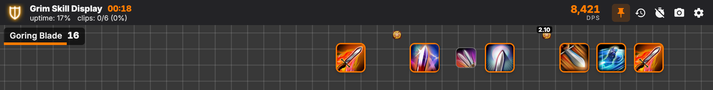
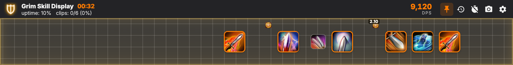
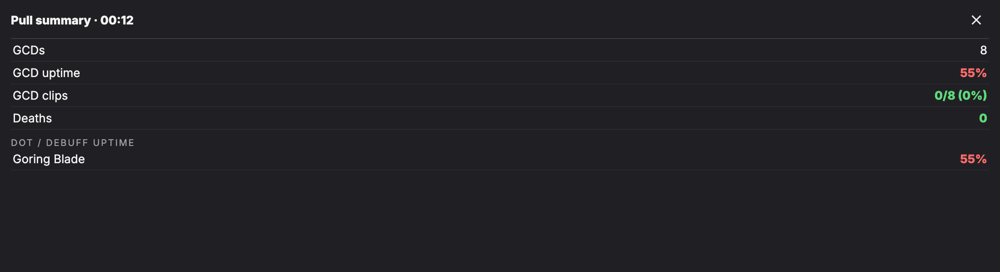
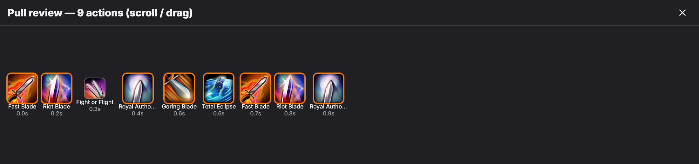
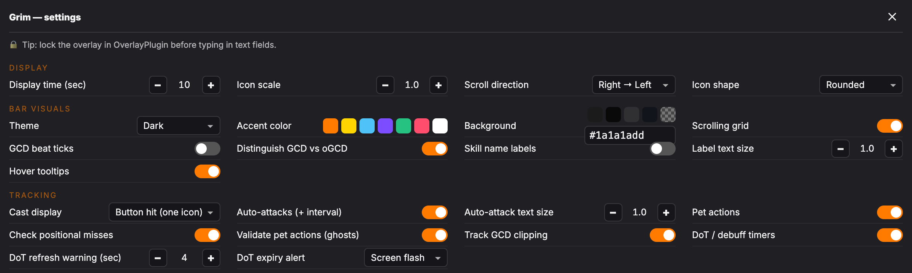

# Grim Skill Display

A FFXIV skill-rotation overlay for **Advanced Combat Tracker (ACT)** + **OverlayPlugin**. Your
skills scroll across a music-bar timeline as you cast them — a modern, self-contained, and
feature-rich replacement for the unmaintained *Kagami* overlay.



> **Why this exists:** Kagami fetched every icon live from the old XIVAPI and shipped a skill
> list frozen at patch 7.0, so anything added since showed up as `??` with no icon. Grim
> **bundles every icon and the full current skill list inside the repo**, so it never breaks
> when an external service goes down — and re-runnable scripts re-sync it after each patch.

---

## Quick start

You need [ACT](https://advancedcombattracker.com/download.php), the
[FFXIV ACT Plugin](https://github.com/ravahn/FFXIV_ACT_Plugin/releases/latest), and
[OverlayPlugin (ngld)](https://github.com/ngld/OverlayPlugin/releases/latest) already installed
and working.

1. In ACT, open **Plugins → OverlayPlugin.dll**.
2. Click **New**. Set **Preset = Custom**, **Type = MiniParse**, give it a name like `Grim`, and
   click **OK**.
3. Select the new overlay in the list on the left, and set the **URL** to:

   ```
   https://jfinsmith.github.io/Grim-Skill-Display/
   ```

4. Click **Reload**. The bar appears — hit a striking dummy and your skills scroll across it.
5. **Hover the top edge** for the header, then click the **⚙ gear** for settings. Drag the bar to
   move it, drag the bottom-right corner to resize, then **lock the overlay** (right-click it in
   OverlayPlugin → *Lock*) when you're happy.

> **Tip:** keep the header **pinned** (📌, the default) if you use a transparent background — a
> fully transparent bar is otherwise click-through and the header only appears when you hover an
> icon.

### Use in OBS

Start **OverlayPlugin → WSServer**, copy the generated overlay URL, and add it as a **Browser
Source** in OBS. Right-click the source → **Interact** to change settings (OBS browser sources
don't share ACT's settings; each one stores its own).

---

## Features

### The bar


- **Music-bar timeline** of your skills and pet skills. Skills pop in, cross the bar, and **fade
  out** at the far edge. Scroll **right→left** or **left→right**.
- **GCD vs oGCD distinction** — GCDs are larger with an accent border; oGCDs are smaller and layer
  on top — so weaves and your rotation's rhythm are readable at a glance.
- **Auto-attack lane** with the time between each auto-attack, so you can eyeball your effective
  attack/skill speed.
- **Cast bars**, interrupt markers (a hard-cast that gets cut shows a red ✖), and **consumable**
  (pot/tincture) and **mount** icons.
- **Live mini-meter** (top-right) — click it to cycle **Personal DPS → Healing/s → Damage taken/s
  → Raid DPS**.
- **GCD uptime %**, **clip %**, and **positional-miss %** live in the header.

### Burst-window highlight



The bar **pulses gold** while a party damage-up buff is on you (Divination, Brotherhood, Embolden,
Searing Light, Battle Litany, Technical Finish, and more) so you can see exactly what you fit into
your burst. The buff list lives in [`resources/data/raidbuffs.json`](resources/data/raidbuffs.json)
and is easy to edit. Toggle: **Highlight raid-buff windows**.

### DoT / debuff tracker

Live countdown pips (top-left) for every DoT and damage-debuff you apply — they fill a bar, turn
**red and flash** when about to expire, and can optionally trigger a **screen flash or beep**. It's
detected straight from the combat log, so it works for **every job automatically** with no per-job
setup.

### Pull summary



When combat ends, a card breaks down the pull: GCDs, **GCD uptime %**, clips, positional misses,
pet ghosts, deaths, and **per-DoT uptime %** — color-coded so problems jump out.

### Pause & review



Click the **⟲ history** button to freeze and scroll back through **every skill you pressed** in the
pull, with timestamps. Drag or scroll the strip.

### More

- **Death & downtime markers** on the timeline.
- **Opener countdown** — a big 5→1 synced to the in-game `/countdown`.
- **Rotation snapshot** — save the last ~15 seconds of the bar as a PNG to share.

### Settings



Everything is configurable from the in-overlay settings panel (it lays out in columns to fit a
wide bar): themes (dark / light / job-color), accent + background color, icon shape and scale,
display time, scroll direction, labels, every tracker and analysis feature, the meter metric, and
language.

> All controls are click-based (steppers, dropdowns, color swatches) because OverlayPlugin's
> embedded browser doesn't handle native dropdowns or sliders well. To type in the **hex
> background field**, lock the overlay first.

---

## Updating after a game patch

Icons and skill data are bundled, so Grim keeps working through patches. When a patch adds new
skills, re-sync the data — this needs [Node.js](https://nodejs.org) 18+:

```bash
node tools/01-fetch-actions.mjs         # refresh the full skill list
node tools/02-fetch-icons.mjs           # download only the newly-referenced icons
node tools/03-fetch-consumables.mjs     # refresh pots / tinctures
node tools/04-fetch-mounts.mjs          # refresh mounts
node tools/05-fetch-generalactions.mjs  # refresh general actions (Desynthesis, Repair, ...)

git add resources && git commit -m "Resync data for patch X.Y" && git push
```

Data comes from [XIVAPI v2](https://v2.xivapi.com/). All FFXIV content is © SQUARE ENIX.

---

## Project layout

```
index.html               entry point (loads the modules + OverlayPlugin bridge)
src/                      ES modules — no build step
  app.js                   orchestrator / startup
  act.js                   ACT · OverlayPlugin · WebSocket listener
  parser.js                interprets battle-log lines, drives every feature
  bar.js                   the scrolling skill bar
  meter.js                 live DPS/HPS/DT/rDPS meter
  dots.js                  DoT / debuff tracker
  rotation.js              positional + GCD-clip + uptime analysis
  features.js              raid-buff glow, markers, countdown, summary, alerts
  review.js                pause & scrollback
  header.js  settings-ui.js  tooltip.js  snapshot.js  store.js  data.js  lang.js
resources/
  data/*.json              actions, items, mounts, jobs, raid buffs, language, settings
  icons/*.png              ~2,700 bundled HD icons (skills, items, mounts)
  classjob/                job-icon spritesheet
tools/*.mjs                data-regeneration scripts (run with Node; not shipped to users)
docs/img/                  screenshots used in this README
```

No bundler, no `npm install` for the overlay itself — it's plain HTML/CSS/ES-modules served
straight from GitHub Pages. The `tools/` scripts are the only thing that uses Node, and only when
you want to refresh the bundled data.

---

## Notes & limitations

- **Raid-buff highlight** and the **opener countdown** match by English text, so on non-English
  clients you'll want to add the localized status / system-message names (see the comment in
  `raidbuffs.json`).
- **Positional detection** covers MNK / DRG / NIN / SAM / RPR via known action IDs; if a positional
  looks wrong after a patch, the IDs in `src/rotation.js` may need a refresh.
- **Downtime markers** are an approximation (long gaps between GCDs) — turn them off if they're
  noisy for your content.

---

## Credits

- Original concept and much of the battle-log handling: **Kagami** by *ram*, fork by *sgosiaco*
  (MIT). Grim is an independent modernization and expansion.
- Game data & icons via **XIVAPI v2**. All FINAL FANTASY XIV content is property of **SQUARE ENIX
  CO., LTD.**

Released under the **MIT License** — see [LICENSE](LICENSE).
